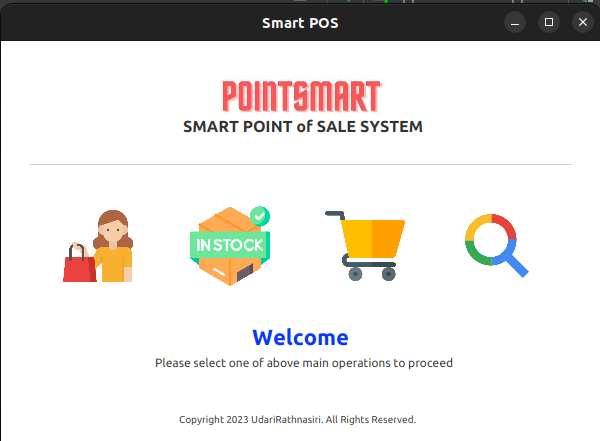

# PointSmart 
## Smart Point of Sale Application
Welcome to our cutting-edge Point of Sale (POS) system, designed to transform your retail experience and elevate your business to new heights. Our software seamlessly integrates key features to empower you in managing transactions, inventory, and customer relations with unparalleled efficiency. Embrace the future of retail with the modern and user-friendly POS solution.

### Version
0.1.0

### Key Features
1. Intuitive User Interface: 
   Navigate effortlessly through sleek and intuitive interface, designed for ease of use.
2. All-in-One Functionality:
   Manage transactions, inventory, and customer relations all in one place.
   Eliminate the need for multiple systems and enjoy the convenience of a comprehensive POS solution.

### Applied Tech Stack
1. Java
2. JavaFX
3. PostgreSQL
4. JUnit

### Snapshot

### License
Copyright &copy; 2023 UdariRathnasiri. All Rights Reserved. 
This project is licensed under the [MIT License](LICENSE.txt)
